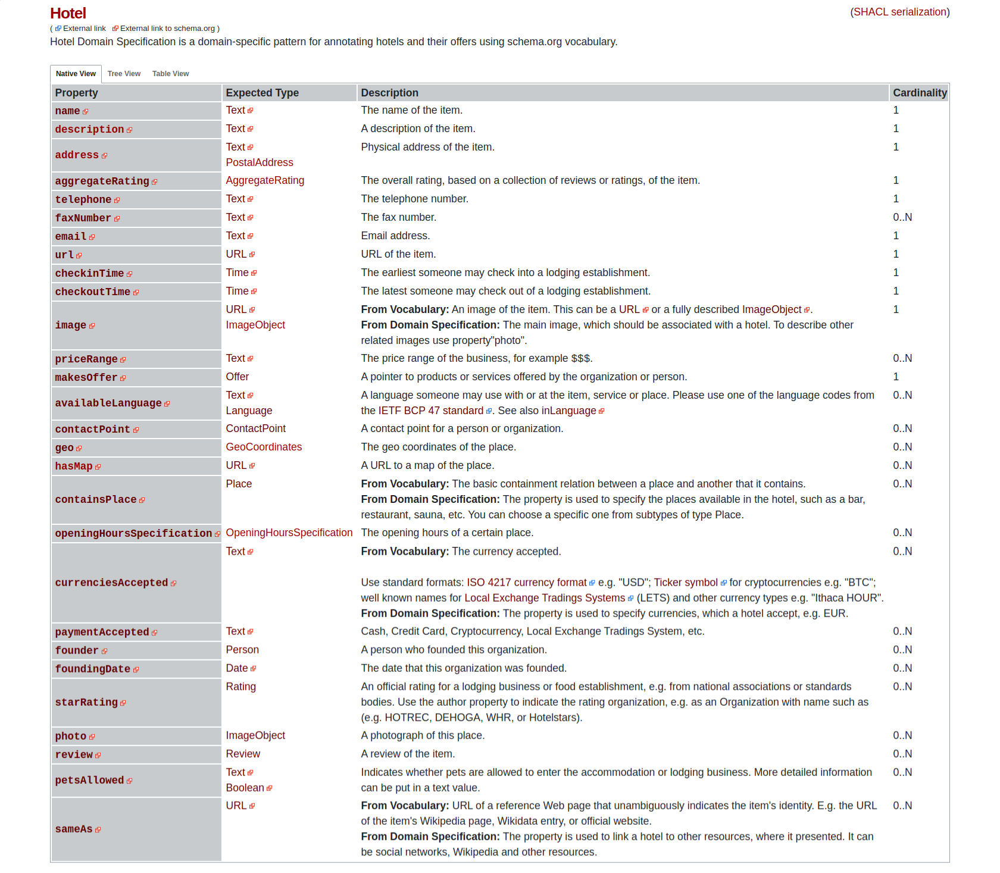

# Domain Specification Browser

## Installation

### Installation via CDN

Add the CSS and the bundled CDN file to your website:

``` html
<link rel="stylesheet" type="text/css" href="https://cdn.jsdelivr.net/gh/semantifyit/ds-browser@76f4c55/ds-browser.css" />
<script src="https://cdn.jsdelivr.net/gh/semantifyit/ds-browser@76f4c55/dist/ds-browser.min.js">
```

## Usage

Use the function `DSBrowser()` to render a Domain Specification Browser in a target HTML element.

You can use the Domain Specification directly as object or pass a URL to its location.

``` html
<div id="ds"></div>
<script>
    (async function() {
        const dsURL = 'https://semantify.it/ds/rQHgkTdOr';
        const dsBrowser = new DSBrowser(document.getElementById('test'), dsURL);
        await dsBrowser.render();
    })();
</script>
```

It is also possible to render a List of Domain Specifications. In order to do that, you need to pass the `type` argument to the function `DSBrowser()`. The `type` argument is `'DS'` by default, but must be `'LIST'` to render a List of Domain Specifications.

``` html
<div id="ds"></div>
<script>
    (async function() {
        const listURL = 'https://semantify.it/list/wS4r3c9hQ';
        const dsBrowser = new DSBrowser(document.getElementById('test'), listURL, 'LIST');
        await dsBrowser.render();
    })();
</script>
```

## Screenshot

